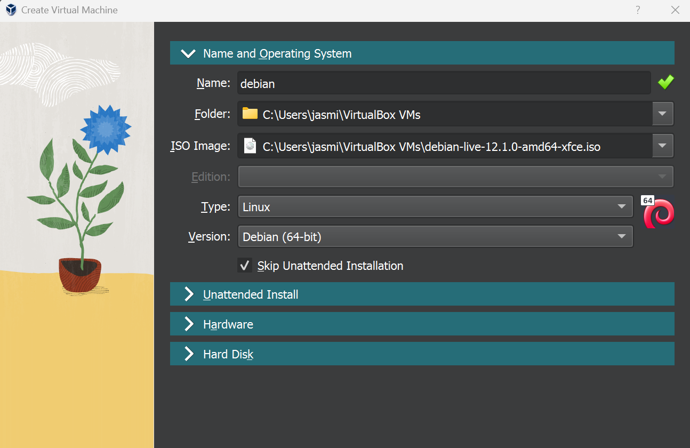
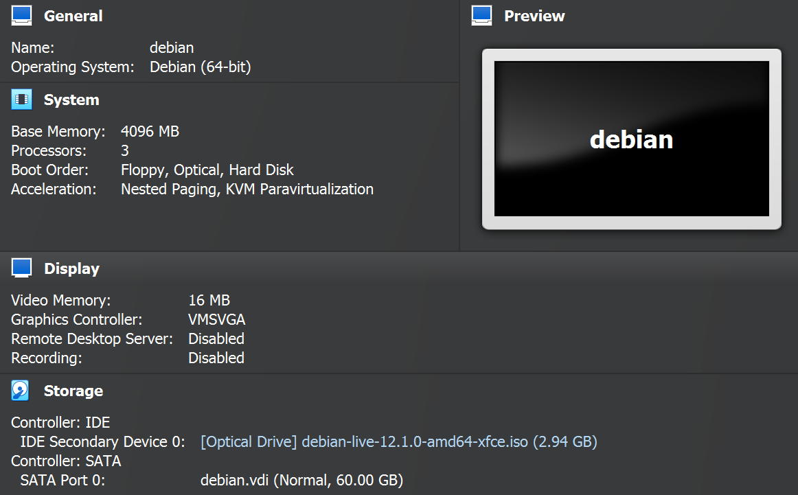
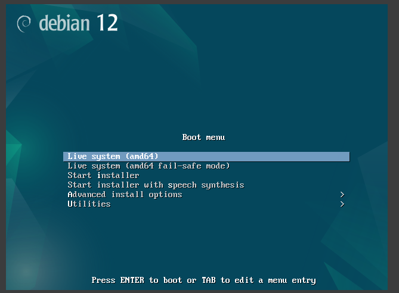
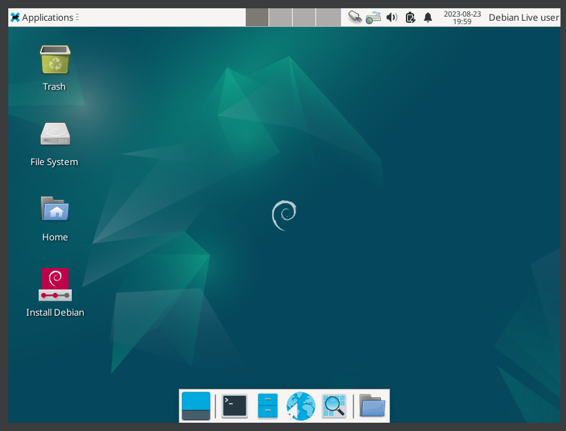
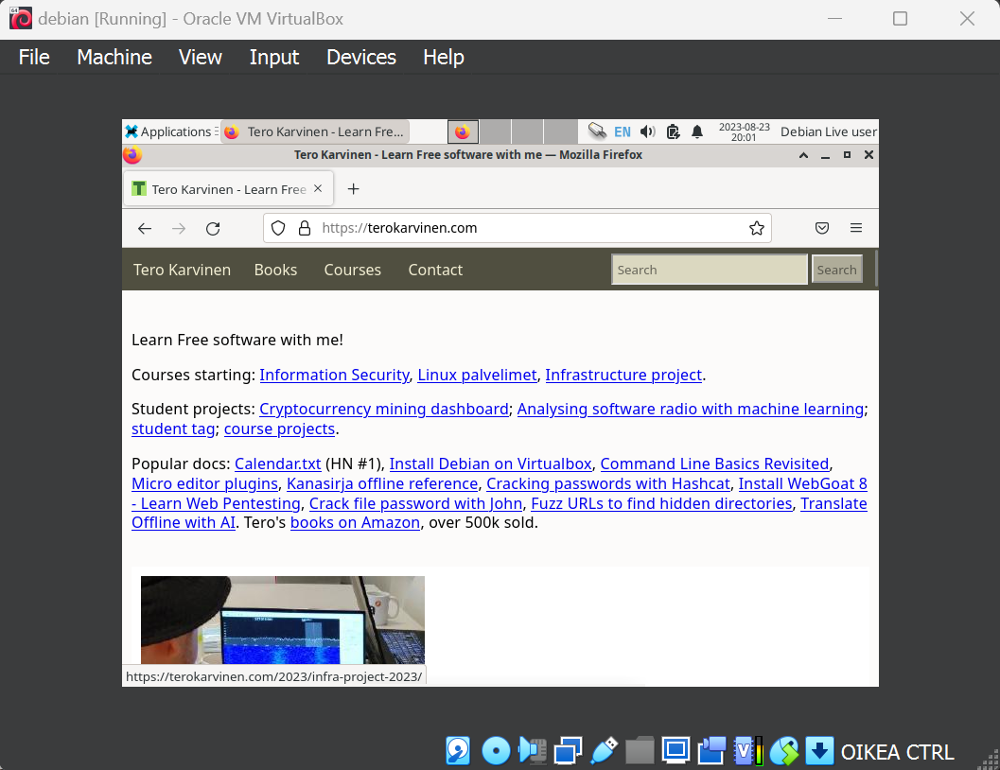
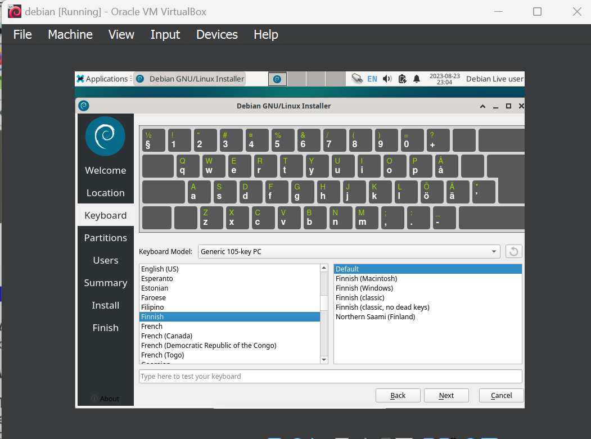
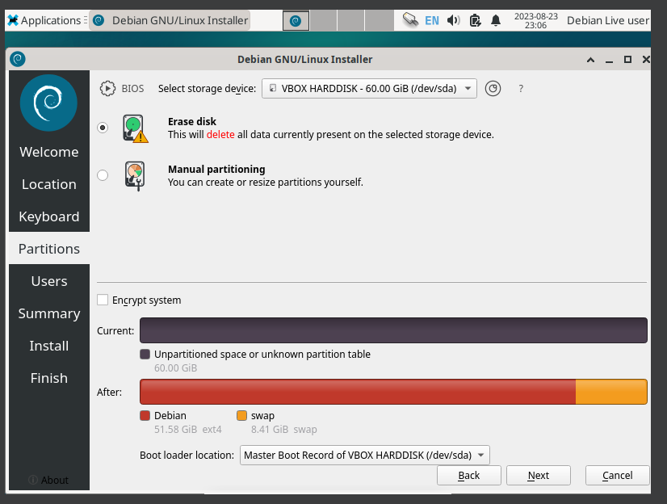
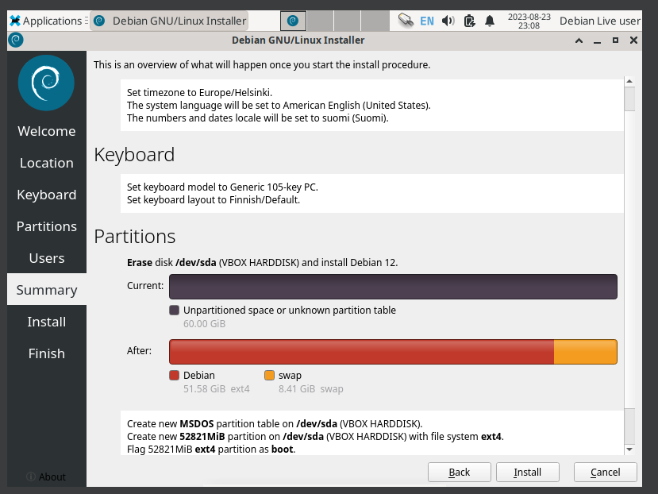
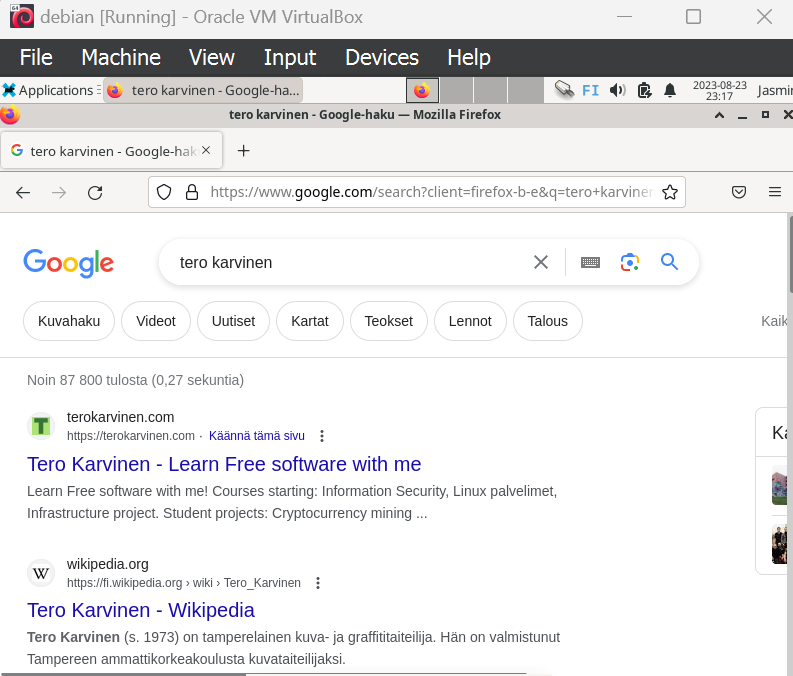
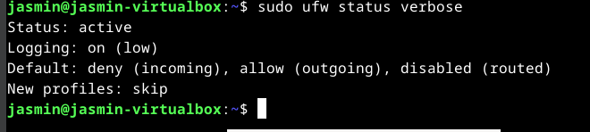

# x) Raportin kirjoittaminen ja FSF Free Software Definition
Hyvä raportti on toistettava, täsmällinen, helppolukuinen ja sisältää lähdeviitteet.
- Raportti on kirjoitettu siten, että lukija voi toistaa testin tulokset seuraamalla raporttia.
- Raportti on kirjoitettu täsmällisesti kertoen ja kuvaillen mm. työvaiheita ja työympäristöjä.
- Raportti on kirjoitettu helppolukuiseksi välttämällä kirjoitusvirheitä ja käyttäen väliotsikoita.
- Raportti noudattaa akateemisia käytäntöjä viittaamalla lähteisiin.
Ilmainen/vapaa ohjelmisto on ohjelmisto, joka mahdollistaa käyttäjälle vapauden käyttää, kopioida, jakaa, muuttaa, kehittää ja opiskella ohjelmiston toimintaa.

lähteet: https://terokarvinen.com/2006/raportin-kirjoittaminen-4/
https://www.gnu.org/philosophy/free-sw.html

# a) Linuxin asentaminen
Tässä harjoituksessa asensin virtuaalikoneelle Debian linuxin. 
Harjoitus on tehty hp omen 16 -kannettavalla, jossa on windows 11(versio 22H2) -käyttöjärjestelmä.

Minulla oli koneella valmiiksi ajantasainen 7.0.10 versio VM Virtual Boxista, joka on virtuaalikoneiden hallintaohjelma. Latasin levykuvan Debianin sivuilta ja valitsin uusimman version (debian-live-12.1.0-amd64-xfce.iso).

Virtual Boxissa valitsin New luodakseni uuden virtuaalikoneen määrittelin koneen alla olevan kuvan mukaisesti.



Hardware- välilehdeltä määritin käytettävän muistin(4096) ja prosessorien (3) määrän. 
Hard Disk -välilehdeltä määritin käytettävän kovalevy tilan.


Boot menusta valitsin live järjestelmän, joka on yleisesti suositeltavaa uutta käyttöjärjestelmää asentaessa, sillä se sallii käyttöjärjestelmään tutustumisen ennen lopullista asentamista.


Kone käynnistyi asennuksen jälkeen normaalisti.


Testasin hiiren, näppäimistön (jenkkinäppäimistö) ja verkon toimintaa valitsemalla Applications valikosta selaimen ja hain terokarvinen.com. Kaikki vaikutti toimivan moitteettomasti. 


Seuraavaksi lähdin ajamaan asennusta, valitsemalla työpöydältä Install Debian-ohjelman. 
Kieleksi valitsin American English, sillä se on käytännöllisin kieli tietokoneita käyttäessä.
Alueeksi valitsin Helsingin. Näppäimistöksi valitsin suomalaisen näppäimistön. 



Partitions -lehdeltä Valitsin 'Erase disk', koska se on turvallisin valinta järjestelmän toiminnan varmistamiseksi.  Users -lehdellä määritin pääkäyttäjän nimen, koneen nimen ja salasanan. 


Vielä yhteenvetona määritellyt asiat.


Asennuksessa minun koneella kesti ~4 min. Kone käynnistyi asennuksen jälkeen automaattisesti ja sain eteeni kirjautumisnäkymän. Kirjauduin sisään koneelle ja testasin selaimessa hakea 'tero karvinen'. Testasin myös ääkkösten toiminnan. 



Tämän jälkeen avasin terminaalin asentaakseni mahdolliset päivitykset. Ajoin komennon `sudo apt-get update`. Komento kysyi salasanan jonka jälkeen latasi päivitykset. Tämän jälkeen ajoin vielä komennon  `sudo apt-get -y dist-upgrade` . Tämä komento latasi kaikista koneen ohjelmistoista uuden version. Tämän jälkeen latasin vielä palomuurin ja laitoin sen päälle komennoilla: 
```bash 
sudo apt-get -y install ufw
sudo ufw enable
```
Tarkistin vielä, että palomuuri meni päälle, ennen kun käynnistin koneen uudelleen.


Uudelleen käynnistyksen jälkeen kone käynnistyi normaalisti.

Lähteet: https://terokarvinen.com/2021/install-debian-on-virtualbox/
