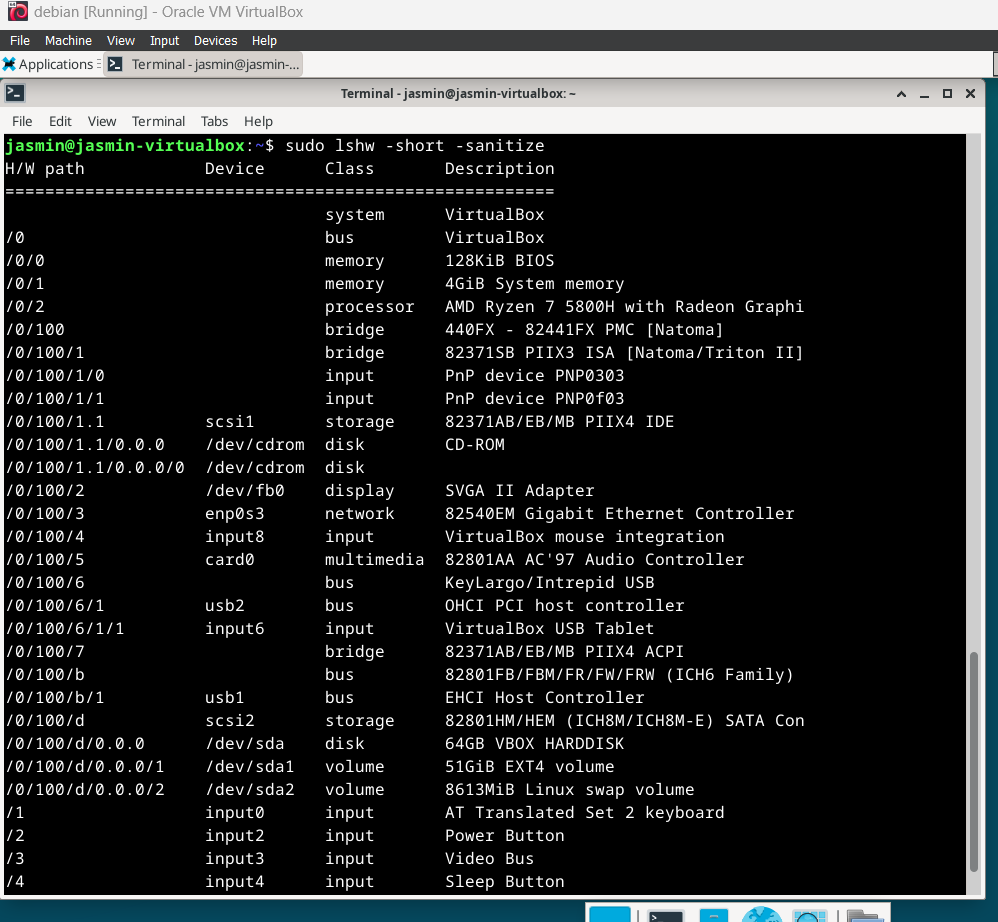

# command line basics
Komentorivillä liikkumiseen olennaisia komentoja:
- `pwd` tulostaa nykyisen hakemiston
- `ls` listaa tiedostot
- `cd` komennolla voidaan vaihtaa sijaintia.
- `less example.txt` komento helpottaa pitkän tiedoston lukemista
- `man` komento näyttää manuaali sivun halutusta komennosta.

Karvinen 2020: https://terokarvinen.com/2020/command-line-basics-revisited/?fromSearch=command%20line%20basics%20revisited
# micro
Asensin micro teksieditorin komennoilla
```bash
sudo apt update
sudo apt install micro
```
Ensimmäinen komento ajaa päivitykset, joilla varmistetaan, että saadaan ladattua uusin versio microsta. Toinen komento asentaa micron.

# rauta

Selvitin koneen raudan sisällön lshw ohjelmalla. Minulla ei ollut virtuaalikoneella asennettuna vielä lshw -ohjelmaa, joten asensin sen `sudo apt install lshw` komennolla. `sudo lshw -short -sanitize` Komento tulostaa listauksen koneen raudasta.   Komennon osa 'short' tekee datasta luettavampaa, 'sanitize' takaa sen, että se ei sisällä arkoja tietoja.
Listauksessa näkyy tietokoneen järjestelmä, joka on tässä tapauksessa VirtualBox, koneen ramin ja biosin muistin määrä, sekä prosessorin (AMD ryzen 7 5800H). Listauksessa on myös muita virtualisoituja osia.


# ohjelmien asennus
Asensin ohjelmat Tmux, Xclip ja neofetch komennolla:
```bash
sudo apt install tmux xclip neofetch
```
### tmux
Tmux on teminaalin "multiplexer" ohjelma, joka mahdollistaa usean terminaaliohjelman suorittamisen samanaikaisesti sen sisällä. Tmux jää myös pyörimään taustalle jos etäyhteys koneeseen katkeaa. Ohjelma käynnistetään `tmux` komennolla. Etäyhteyden katketessa tmux session saa palautettua komennolla `tmux attach`.

### neofetch
Neofetch näyttää järjestelmän tietoja esteettisemmin ja helpommin tulkittavasti. Ohjelma käynnistetään ajamalla komento `neofetch`.


### xclip
Xclip ottaa standardi inputista dataa ja laittaa sen leikepöydälle. 

# FHS
Juurihakemisto josta löytyy kaikki järjestelmän kansiot ja tiedostot.


`/home` sisältää käyttäjien hakemistot.


`/home/jasmin` sisältää yhden käyttäjän kansiot ja tiedostot. Sisältää esim. Documents kansion, jostaa löytyy tiedostoja.


`/media/jasmin` näyttää järjestelmään liitetyn ulkoisen laitteen, kuten usb-tikun cd:n tai muun vastaavan tiedostot.


# grep
Grep ottaa standardi inputista tekstiä, josta se hakee määritetyllä hakuehdoilla, tässä tilanteessa kaikkea mikä sisältää 'usb' sanan.  (sudo dmesg näyttää viestejä kernelistä)


Journalctl hakee systemd:n lokeja. Grep valitsee ne rivit joissa lukee sshd.


Tässä välissä latasin ripgrepin, joka on nopeampi kuin normaali grep. ripgrep komento käy rekursiivisesti läpi kaikki kansiot nykyisessä tai valitussa hakemistossa ja etsii kaikista tiedostoista valituilla hakuehdoilla. 


# pipe
Putkista on tämän raportin aikana näkynyt joitakin esimerkkejä jo. Hyvänä esimerkkinä toimii xclipin demonstroinissa käyttämäni komento `ls -la | xclip -sel c`. Tässä komennossa ls -la antaa dataa ulos ja putki ohjaa sen seuraavalle komennolle, eli xclipille. 

# tukki

Aiheutin lokiin kaksi tapahtumaa, jossa toisessa ajoin `sudo ls` komennon onnistuneesti ja toisessa `su root` komennon epäonnistuneesti laittamalla salasanan väärin.


## lähteet
 Tmux: https://github.com/tmux/tmux/wiki
 
 Neofetch:  https://github.com/dylanaraps/neofetch
 
 Xclip: https://github.com/astrand/xclip
 
 Ripgrep: https://github.com/BurntSushi/ripgrep
