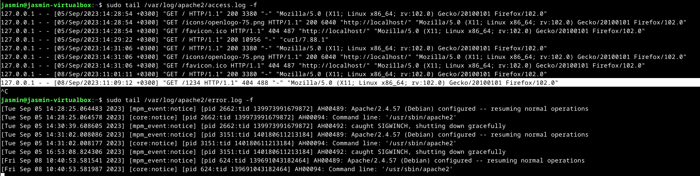
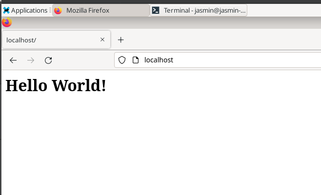
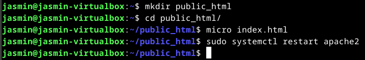
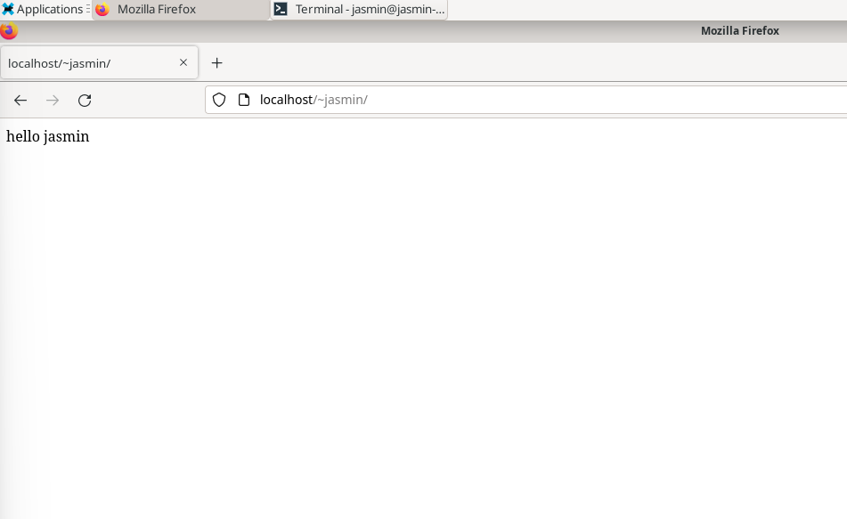
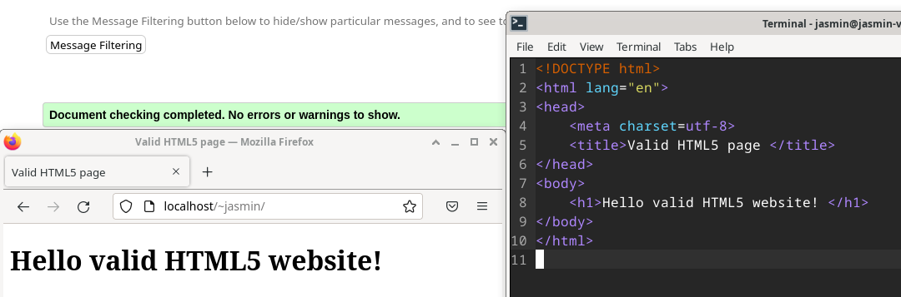
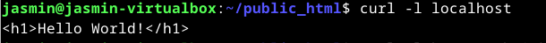
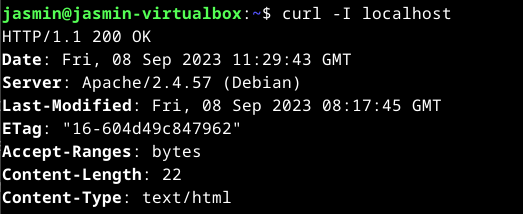
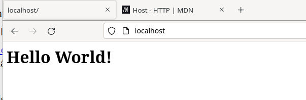

# h3 Hello Web Server
## x) Apachen asennus
Tärkeitä komentoja apachen asennukseen liittyen:

`sudo apt install apache2` komennolla asennetaan apache.

`sudo a2enmod userdir` komento antaa käyttäjälle luvan tehdä sivuja.

`sudo systemctl restart apache2` komento uudelleen käynnistää apachen, jolloin muutokset tulevat voimaan.

(Karvinen, 2008)

## a) apache
Ensiksi ajoin päivitykset `sudo apt update` komennolla, jonka jälkeen asensin apachen `sudo apt install apache2` komennolla.

## b)Lokirivit
Menin selaimella localhost osoitteeseen, jonka jälkeen ajoin terminaallissa seuraavat komennot:
```bash
sudo tail /var/log/apache2/access.log -f
sudo tail /var/log/apache2/error.log -f
```


'GET' on metodi, joka hakee sivuja. '/1234' On haettu polku. '404' On statuskoodi, tässä esimerkissä localhost/1234 sivua ei ole olemassa, josta virhekoodi johtuu. '488' On vastauskoodi tavuina. '"-"' On referer.    


## c) Apache sivujen vaihto
Vaihdoin apachen esimerkkisivun lyhyeen omaan sivuun seuraavia komentoja hyödyntäen:
```bash
cd /var/www/html/
sudo micro index.html
sudo systemctl restart apache2
```
Ensimmäisellä komennolla navigoin oikeaan kansioon. Toisella komennolla avasin index.html tiedoston micro teksieditorilla, poistin sieltä apachen oletuskoodit  ja vaihdoin sen omaani. Kolmannella komennolla uudelleen käynnistin apachen, jotta muutokset tulisivat näkyviin. 



## d) Käyttäjän kotisivu
Laitoin käyttäjäni kotisivun toimimaan ajamalla ensiksi seuraavat komennot 
```bash
sudo a2enmod userdir
systemctl restart apache
```
Tämän jälkeen tein käyttäjän `home` kansioon `public_html` kansion, johon tein `index.html` tiedoston. Uudelleen käynnistin apachen, jotta muutokset tulisivat näkyviin `localhost/~jasmin` osoitteessa. 




## e) HTML sivu
Tein html sivun ja testasin onko se validi. 



## F)
Ajoin komennon `curl localhost`, joka palauttaa sivun HTML-koodin. 



Seuraavaksi ajoin `curl -I localhost`, joka pyytää HTTP-tiedot sivulta. 



`HTTP/1.1 200 OK` kertoo, että HTTP-pyyntö onnistui ja palvelin palautti koodin 200, mikä tarkoittaa "OK".
`Date:` kertoo vastauksen ajan jolloin pyyntö käsiteltiin palvelimella. 
`Server: Apache/2.4.57 (Debian)` Kertoo mitä palvelinta on käytetty ja suluissa kertoo millä alustalla. 
`Last-Modified:` Ilmaisee viimeisimmän muokkausajan.
`ETag` On tunniste, joka viittaa sivun resurssin versioon.
`Accept-Ranges: 'bytes'` Ilmaisee, että palvelin tukee resurssin hankintaa tavuittain(byte-range request).
`Content-Length` Kertoo monta tavua vastaus pitää sisällään.
`Content-Type` Kertoo mediatyypin.

## n) Nimipohjainen virtuaalipalvelu
Katsoin [esimerkkiä](https://httpd.apache.org/docs/trunk/vhosts/examples.html#twoips), jonka pohjalta lähdin muokkaamaan apache konfiguraatio tiedostoa. Lisäsin sinne konfiguraation jotain.localhost domainille. jotain.localhost hakee tiedostot eri paikasta, kuin localhost.




```
<VirtualHost localhost:80>
	# The ServerName directive sets the request scheme, hostname and port that
	# the server uses to identify itself. This is used when creating
	# redirection URLs. In the context of virtual hosts, the ServerName
	# specifies what hostname must appear in the request's Host: header to
	# match this virtual host. For the default virtual host (this file) this
	# value is not decisive as it is used as a last resort host regardless.
	# However, you must set it for any further virtual host explicitly.
	#ServerName www.example.com

	ServerAdmin webmaster@localhost
	DocumentRoot /var/www/html

	# Available loglevels: trace8, ..., trace1, debug, info, notice, warn,
	# error, crit, alert, emerg.
	# It is also possible to configure the loglevel for particular
	# modules, e.g.
	#LogLevel info ssl:warn

	ErrorLog ${APACHE_LOG_DIR}/error.log
	CustomLog ${APACHE_LOG_DIR}/access.log combined

	# For most configuration files from conf-available/, which are
	# enabled or disabled at a global level, it is possible to
	# include a line for only one particular virtual host. For example the
	# following line enables the CGI configuration for this host only
	# after it has been globally disabled with "a2disconf".
	#Include conf-available/serve-cgi-bin.conf
</VirtualHost>
<VirtualHost jotain.localhost:80>
	# The ServerName directive sets the request scheme, hostname and port that
	# the server uses to identify itself. This is used when creating
	# redirection URLs. In the context of virtual hosts, the ServerName
	# specifies what hostname must appear in the request's Host: header to
	# match this virtual host. For the default virtual host (this file) this
	# value is not decisive as it is used as a last resort host regardless.
	# However, you must set it for any further virtual host explicitly.
	#ServerName www.example.com

	ServerAdmin webmaster@localhost
	DocumentRoot /var/www/html/jotain

	# Available loglevels: trace8, ..., trace1, debug, info, notice, warn,
	# error, crit, alert, emerg.
	# It is also possible to configure the loglevel for particular
	# modules, e.g.
	#LogLevel info ssl:warn

	ErrorLog ${APACHE_LOG_DIR}/error.log
	CustomLog ${APACHE_LOG_DIR}/access.log combined

	# For most configuration files from conf-available/, which are
	# enabled or disabled at a global level, it is possible to
	# include a line for only one particular virtual host. For example the
	# following line enables the CGI configuration for this host only
	# after it has been globally disabled with "a2disconf".
	#Include conf-available/serve-cgi-bin.conf
</VirtualHost>

```
Yllä on minun apache configuraatio. 
Kun selain lähettää http pyynnön palvelimelle, se laittaa sen käytetyn domain nimen host headeriin. Palvelin ottaa pyynnön vastaa ja katsoo host headerin perustelee, mitä konfiguraatioita se käyttää. 

## Lähteet
Apache s.a. Name-based hosts on more than one IP address. Luettavissa: https://httpd.apache.org/docs/trunk/vhosts/examples.html#twoips

Karvinen, T. 2008. Install Apache Web Server on Ubuntu. Luettavissa: https://terokarvinen.com/2008/05/02/install-apache-web-server-on-ubuntu-4/

Kumar, S. 2023. How to Enable Apache Userdir Module on RHEL/CentOS?. tutorialspoint. Luettavissa: https://www.tutorialspoint.com/how-to-enable-apache-userdir-module-on-rhel-centos

Mdn web docs. 2023. Host. Luettavissa: https://developer.mozilla.org/en-US/docs/Web/HTTP/Headers/Host


