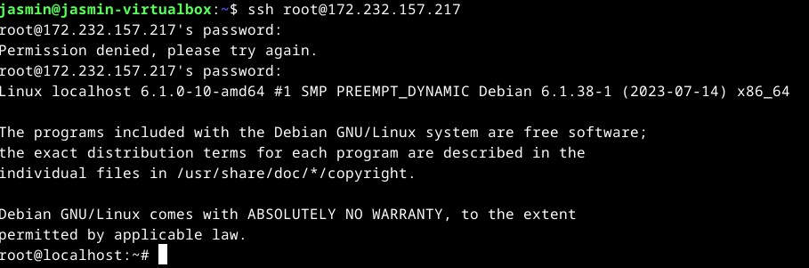
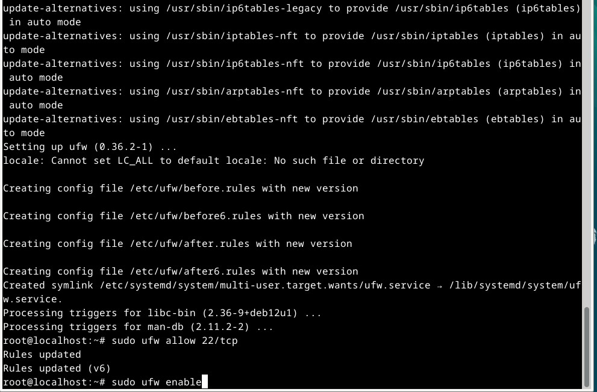
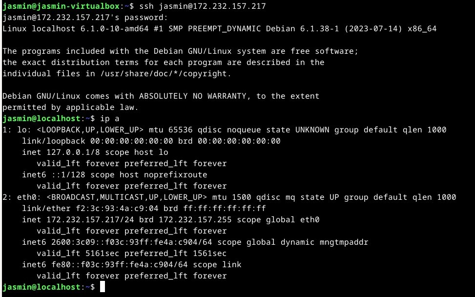
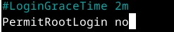
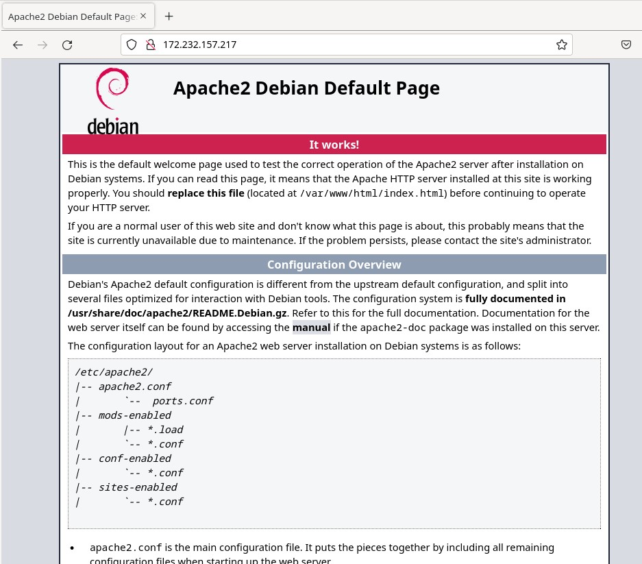
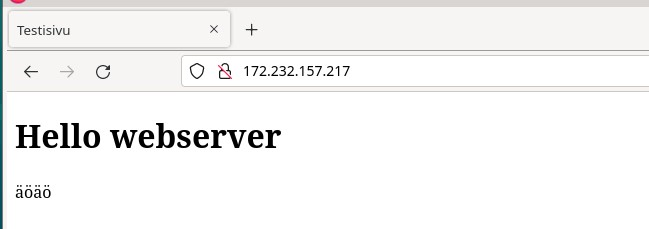
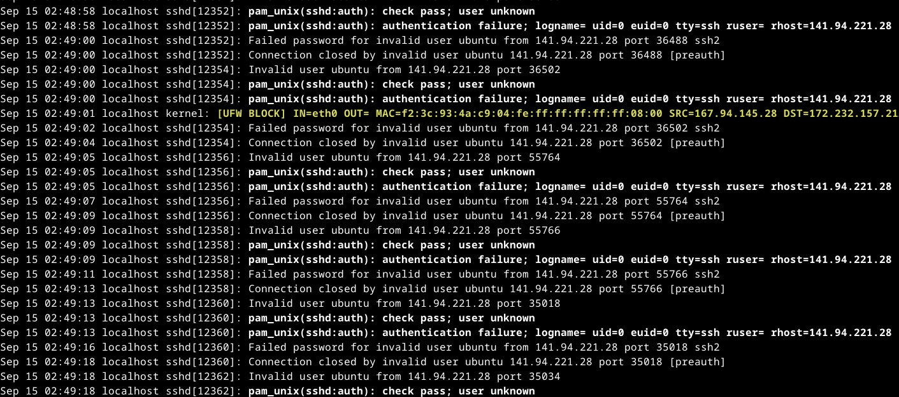
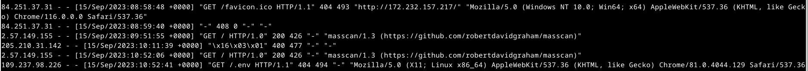
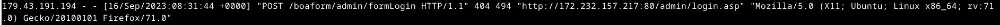

## x) Tiivistelmä
Virtuaalipalvelimen käyttöönotto.
- Vuokraa palvelin haluamaltasi palveluntarjoajalta.
- Vahvojen salasanojenkäyttö tärkeää kaikissa vaiheissa.
- Palomuurin pystytys `sudo ufw enable` -komennolla. Tärkeää muistaa tehdä tarvittavat reiät palomuuriin ennen käyttöönottoa.
- Ennen root -käyttäjän lukitsemista luodaan ensin toinen käyttäjä sudo-oikeuksilla.
- Ohjelmistojen päivittäminen.

(Karvinen,T. 2017)

## a) Palvelimen vuokraus
Vuokrasin palvelimen linodelta, koska ostaminen sieltä oli helppoa ja edullista.
Salasanojen valinnassa käytin salasanojen hallintaohjelmaa.

|   |   |
|---|---|
| Distribution | Debian 12 |
| Region | Stockholm, SE |
| Shared CPU | Nanode 1gb |

## b)  Alkutiomet virtuaalipalvelimella
Otin yhteyden SSH:lla root -käyttäjänä palvelimeeni (palvelimen osoite @-merkin jälkeen).  

Ajoin päivitykset tuttuun tapaan `sudo apt update` -komennolla. Asensin palomuurin `sudo apt-get install ufw` komennolla. Tämän jälkeen tein palomuuriin reiän `sudo ufw allow 22/tcp` -komennolla.  Tämä komento sallii liikenteen porttiin 22. (Päästää ssh liikenteen palomuurista)
Laitoin palomuurin päälle komennilla `sudo ufw enable`. 

Seuraavaksi tein käyttäjän nimeltä 'jasmin' ja laitoin sille sudo oikeudet `sudo adduser jasmin sudo` -komennolla. 

Tarkistin, että sain SSH-yhteyden käyttäjällä 'jasmin' palvelimeen varmistaakseni uuden käyttäjän toimivuuden.  Ajoin `ip a` -komennon, jolla tarkistin vielä, että varmasti sain yhteyden.  `ip a` -komento antaa näkymän verkko-osotteista ja rajapinnoista, jotka ovat saatavilla koneessa. 

Suljin root-tunnuksen salasanan `sudo usermod --lock root` -komennolla. Root-kirjautumisen SSHlla poistin ensiksi ajamalla komennon `sudoedit /etc/ssh/sshd_config`. 
Komento avaa `sshd_config` asetustiedoston. Etsin tiedostosta rivin `PerminRootLogin` ja asetin sen arvoksi 'no'. Käytin komentoa `sudo service ssh restart` päivittääkseni asetukset. Päivitin vielä softwaren `sudo apt update`
ja `sudo apt upgrade` -komennoilla.

## c) Webbipalvelimen asennus
Asensin virtuaalipalvelimelle apachen web-palvelimen `sudo apt-get install apache2` -komennolla. Tein palomuuriin reiän `sudo ufw allow 80/tcp`. Tämä tekee tarvittavan reiän palomuuriin, jotta web-palvelin voi vastaanottaa HTTP-pyyntöjä.

Testasin web-palvelimen toiminnan ensin menemällä verkkoselaimeen ja käyttämällä virtuaalipalvelimeni IP-osoitetta. Tämä vahvisti, että Apache2 oli asennettu ja toimi.

Seuraavaksi ryhdyin vaihtamaan apachen oletussivun yksinkertaiseen HTML5 testisivuun. Tässä vaiheessa asensin myös micro-tekstieditorin `sudo apt-get install micro` komennolla. 
`cd var/www/html` -komennolla siirryin kansioon missä sijaitsee `index.html` -tiedosto, jota muokkaammalla sain apachen oletussivun muutettua. 

## d) Murtautumisyrityksiä

Suoritin seuraavan komennon: `journalctl -n 2000; journalctl --since today`. Tämä komento haki 2000 viimeisintä lokimerkintää systemd-journalista ja rajasi ne vain tämän päivän merkintöihin.

Tarkistin lokitiedot ja hiemän yllättäen huomasin, että tänä päivänä ei ollut tallentunut merkittävästi murtautumisyrityksiä. Kuitenkin löysin yhden IP-osoitteen, joka esiintyi useita kertoja. Tämä voi viitata siihen, että "murtautuja" käyttää huonosti optimoitua scriptiä tai toistuvia yrityksiä, jotka eivät ole olleet menestyksekkäitä.

`Sep 15 02:49:00 localhost sshd[12352]: Failed password for invalid user ubuntu from 141.94.221.28 port 36488 ssh2`
Tässä käyttäjä yritti kirjautua SSH:lla palvelimeen käyttäjänimellä "ubuntu", mutta kirjautuminen epäonnistui ("Failed password"). Käyttäjä oli virheellinen ("invalid user ubuntu"). Kirjautumisyritys tuli IP-osoitteesta 141.94.221.28 portista 36488 käyttäen SSH-protokollan versiota 2 (ssh2).

`Sep 15 02:49:00 localhost sshd[12352]: Connection closed by invalid user ubuntu 141.94.221.28 port 36488 [preauth]` Tämä rivi ilmoittaa, että yhteys suljettiin käyttäjältä "ubuntu", joka oli virheellinen käyttäjä. Yhteys suljettiin IP-osoitteesta 141.94.221.28 portissa 36488 ennen käyttäjän tunnistamista preauth-vaiheessa, mikä tarkoittaa, että kirjautuminen ei edennyt tunnistamisvaiheeseen.

Ajoin vielä komennon `less /var/log/apache2/access.log`. Apachen lokeihin ei sillä hetkellä ollut tallentunut merkittävän mielenkiintoista tietoa, joten jätin sen odottamaan, että saisin joitain tietoja tutkittavaksi. 
Joitakin mielenkiintoisia tietoja löytyi lokista myöhemmin. 

Tässä kuvassa esimerkkinä 2.57.149.155 ip-osoitteesta on tullut verkkopyyntö palvelimelle. 

'- -' Nämä ovat kaksi väliviivaa, jotka ilmeisesti ilmaisevat käyttäjän tunnistautumista,
mutta tässä ne ovat tyhjiä, mikä tarkoittaa, että tunnistautumista ei käytetty tässä pyynnössä.

[15/Sep/2023:09:51:55 +0000] Tämä on aikaleima, joka osoittaa, milloin verkkopyyntö tapahtui.

"GET / HTTP/1.0" Tämä on HTTP-pyyntömetodi, URI (Uniform Resource Identifier) ja HTTP-protokollan versio.

'200' Tämä on HTTP-vastauskoodi, joka ilmaisee, että pyyntö oli onnistunut.

'426' Tämä on vastauksen koko tavuina

"-" Tämä on kenttä, joka osoittaa viittauksen verkkosivulle, jolta käyttäjä saapui. Tässä se on tyhjä.

"masscan/1.3 ([https://github.com/robertdavidgraham/masscan](https://github.com/robertdavidgraham/masscan))" Tämä on käyttäjän selaimen tai ohjelman käyttämä User-Agent -merkkijono, joka kertoo, millainen ohjelma tai työkalu teki pyynnön. Tässä tapauksessa pyyntö tuli ohjelmasta nimeltä "masscan", joka on verkkoskannerin työkalu. User-Agent -merkkijonossa on myös linkki GitHub-sivulle, josta ohjelman lähdekoodi on saatavilla.

Tässä POST -pyyntö tuli IP-osoitteesta 179.43.191.194 osoitteeseen "/boaform/admin/formLogin", mutta pyydettyä resurssia ei löytynyt palvelimelta (HTTP-tilakoodi 404). 
Pyyntö tuli viittaamalla "Referer"-otsikkoon URL-osoitteeseen "[http://172.232.157.217:80/admin/login.asp](http://172.232.157.217/admin/login.asp)", ja se tehtiin Mozilla Firefox -selaimella Ubuntu Linux -käyttöjärjestelmässä. Tämä saattaa olla yritys kirjautua sisään johonkin hallintapaneeliin, tai turvallisuuteen liittyvää tarkkailua.

## Lähteet
Karvinen, T. 2017. First Steps on a New Virtual Private Server. Luettavissa: https://terokarvinen.com/2017/first-steps-on-a-new-virtual-private-server-an-example-on-digitalocean/
