## x) tiivistelmä
### Vakiosivu apachella
- Apachen asennus `sudo apt install apache`
- Sivut (virtualhosts) sijaitsee /etc/apache2/sites-available/ hakemistossa.
- Uuden virtualhostin voi tehdä tekemällä konfiguraatiotiedoston /etc/apache2/sites-available/ -hakemistoon.
- virtualhost voidaan ottaa käyttöön `sudo a2ensite <nimi>.conf` -komennolla
- virtualhost voidaan ottaa pois käytöstä `sudo a2dissite <nimi>.conf`
- Konfiguraatio tiedostoon pitää laittaa DocumentRoot, eli tiedoston sijainti, ja "Require all granted". 
- index.html -tiedoston oltava samassa kansiossa, kun konfiguraatio tiedoston DocumentRoot osoite.
  
  (Karvinen, 2016)

  Apachella voi olla usea domain-nimi yhtä ip-osoitetta kohden.
  (Karvinen, 2018)

### Nimipohjainen virtuaalipalvelin
- IP-pohjaiset virtuaalipalvelimet vaativat oman IP-osoitteen jokaiselle hostille.
- nimipohjaiset virtuaalipalvelimet voivat jakaa saman IP-osoitteen useiden hostien kesken.
- Nimipohjainen virtuaalipalvelu on yksinkertaisempi ja se säästää IP-osoitteita.
  (Apache)

## Nimipalvelimen vuokraus

Vuokrasin nimipalvelimen namecheapista käyttäen github education -paketin tarjoamaa ilmaista tunnusta. NameCheapissa lisäsin virtuaalipalvelimeni ip-osoitteen. 

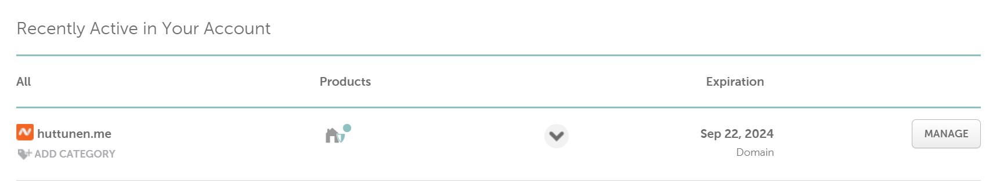

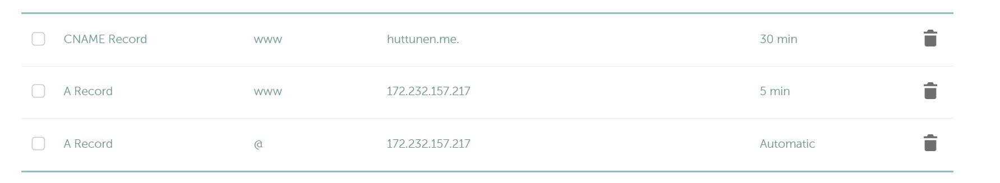

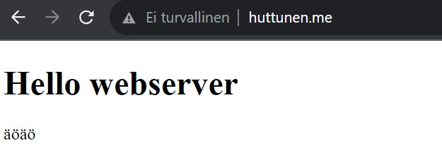

www.huttunen.me toimi välittömästi.

Lisäsin nimipalvelimen hallinnan linodeen, missä virtuaalipalvelimeni sijaitsee, jotta molempien hallinnointi olisi sujuvampaa. Tämä onnistui lisäämällä NameCheapissa Domain välilehdellä nameserver kohtaan linoden osoitteet.  

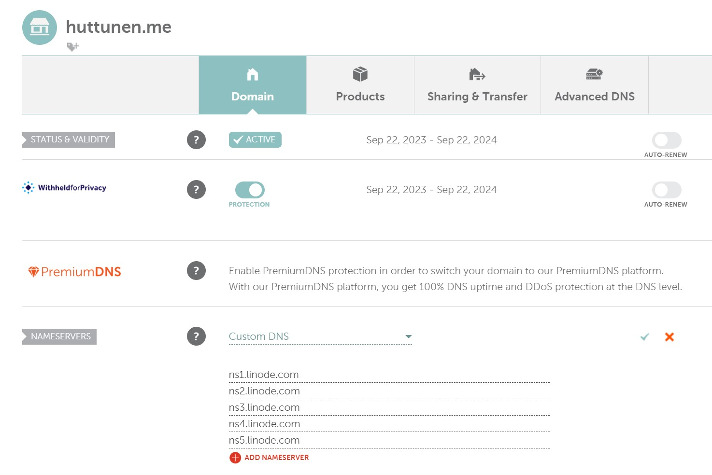


## Oman nimen tutkiminen host ja dig komennoilla
Ajoin komennon `host huttunen.me`. Tämä palautti virtuaalipalvelimeni ip-osoitteet, sekä sähköpostipaketin osoitteen.

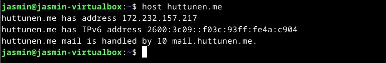

Seuraavaksi ajoin komennon `dig huttunen.me`, joka palautti enemmän tietoa. 

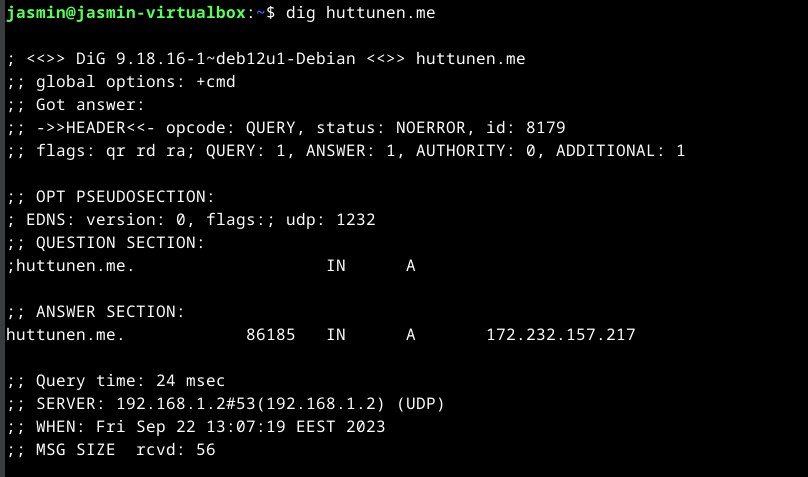

Ensimmäinen rivi näyttää dig -komennon version.

HEADER osio näyttää tiedon mitä palvelimelta saatiin.

OPT PSEUDOSECTION osio näyttää:

	EDNS: DNS:n laajennusmekanismeja (extension system for DNS)
 
	Flags: flageja(?), tässä tapauksessa tyhjä koska niitä ei ole.
 
	UDP: UDP paketin koko.
 
QUESTION näyttää kysely datan mikä on lähetetty.

	Ensimmäinen kohta on domain nimi jota, kyseltiin.
 
	toinen kohta on kyselyn tyyppi (IN = Internet)
 
	kolmas kohta kertoo tietueen.
 
ANSWER osio näyttää:

	Ensimmäisessä kohdassa palvelimen jota haettiin. 
 
	Toisena on Time to Live. 
 
	Kolmantena kyselyn luokka. (class of query)
 
	Neljäntenä tyyppi (type of query)
 
	Viimeisenä on nimipalvelimen ip-osoite.
 
Query time, kertoo kauanko kesti vastauksessa.

SERVER: Vastauksen DNS-palvelimen IP-osoite ja portti.

WHEN: aika jolloin komento ajettiin.

MSG SIZE rcvp: DNS-palvelimen vastauksen koko.


Ajoin vielä komennon `dig huttunen.me any`, joka listaa kaikki DNS-tietueet ja ip-soitteet, jotka se löytää. Tätä komentoa varten jouduin kirjautumaan ssh:lla virtuaalipalvelimelleni, koska joko virtuaalikoneeni, tai verkossani toimiva DNS-palvelin säilöi vanhat DNS tiedot, jonka takia en saanut terminaalissa eri tietoja `any` päätteellä. 

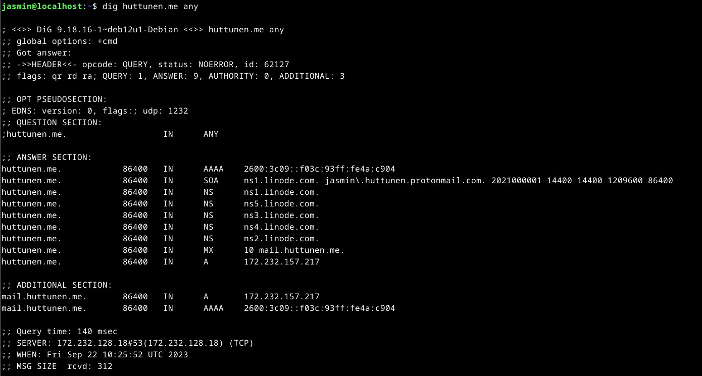


## C
En täysin ymmärtänyt mitä tässä tehtävässä haettiin takaa, mutta yritin parhaani. 
Kopioin oletus konfiguraatio tiedoston `cp 000-default.conf jasmin.conf` -komenolla. Unohdin ajaa komennon sudona, joten ajoin komennon `sudo !!`, joka ajaa aiemman komennon sudona. 

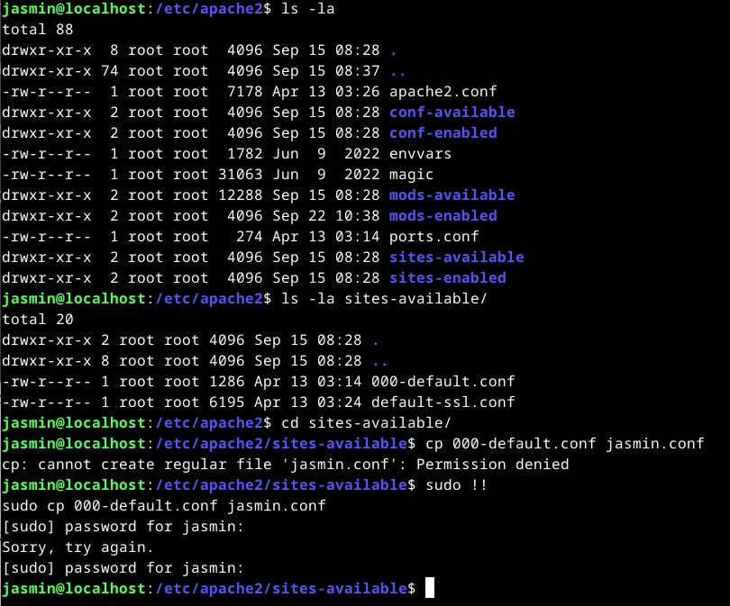

Muokkasin jasmin.conf -tiedostoa `sudoedit jasmin.conf`. Alla konfiguraatio.

```
<VirtualHost *:80>
        # The ServerName directive sets the request scheme, hostname and port that
        # the server uses to identify itself. This is used when creating
        # redirection URLs. In the context of virtual hosts, the ServerName
        # specifies what hostname must appear in the request's Host: header to
        # match this virtual host. For the default virtual host (this file) this
        # value is not decisive as it is used as a last resort host regardless.
        # However, you must set it for any further virtual host explicitly.
        ServerName jotain.huttunen.me

        ServerAdmin webmaster@localhost
        DocumentRoot /home/jasmin/jotain/
        <Directory /home/jasmin/jotain/>
                Require all granted
        </Directory>

        #Available loglevels: trace8, ..., trace1, debug, info, notice, warn,
        # error, crit, alert, emerg.
        # It is also possible to configure the loglevel for particular
        # modules, e.g.
        #LogLevel info ssl:warn

        ErrorLog ${APACHE_LOG_DIR}/error.log
        CustomLog ${APACHE_LOG_DIR}/access.log combined

        # For most configuration files from conf-available/, which are
        # enabled or disabled at a global level, it is possible to
        # include a line for only one particular virtual host. For example the
        # following line enables the CGI configuration for this host only
        # after it has been globally disabled with "a2disconf".
        #Include conf-available/serve-cgi-bin.conf
</VirtualHost>


```

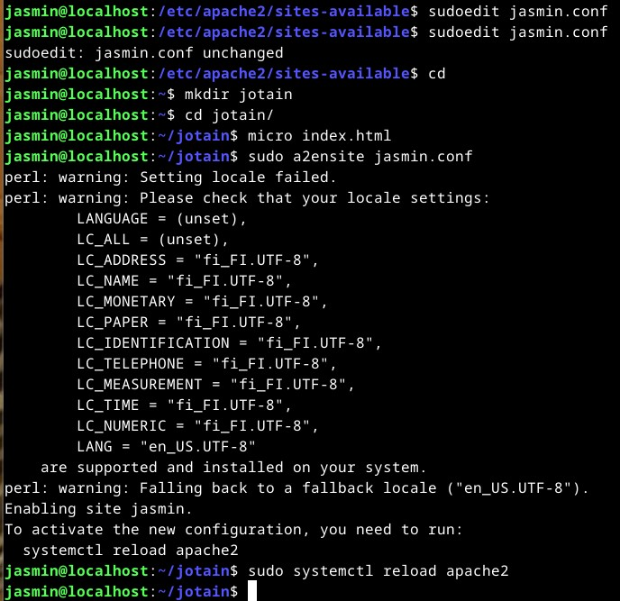

Tein kotihakemistooni "jotain" kansion, jonne tein index.html tiedoston. Ajoin `sudo a2ensite jasmin.conf` -komennon, joka ottaa käyttöön jasmin.conf tiedoston.
Ajoin myös komennon `sudo a2dissite 000-deafult.conf`, joka poistaa oletus konfiguraatio tiedoston. 

Lisäsin linodeen "jotain" a-tietueen, koska käytin "jotain" subdomainia. (Oletin, että käytetään subdomainia)

Meinasin jättää tehtävän kesken, kun en saanut 403 forbidden ilmoitusta katoamaan useista yrityksistä huolimatta. 

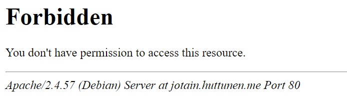

Tämä johtui siitä, kun www-data -käyttäjällä ei ollut oikeuksia lukea html -tiedostoa, siitä huolimatta, että tiedostossa oli luku oikeudet kaikille. 
Ongelma oli siis se, että kotihakemistossani ei ollut execute oikeuksia muille käyttäjille, eli käytännössä muilla, kuin minun käyttäjällä ei ollut oikeuksia nähdä kotihakemistoa. 
Lisäsin execute oikeudet kaikille `chmod +x ../jasmin/` -komennolla.

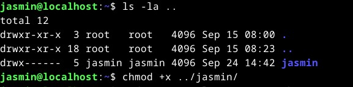

Uudelleen käynnistin palvelimen ja sivu alkoi toimimaan.

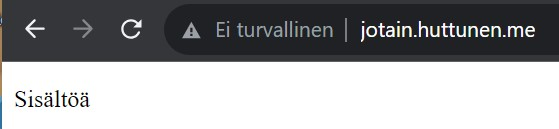

## lähteet
Karvinen, T. 2016. New Default Website with Apache2 – Show your homepage at top of example.com, no tilde. Luettavissa: https://terokarvinen.com/2016/02/16/new-default-website-with-apache2-show-your-homepage-at-top-of-example-com-no-tilde/

Karvinen, T. 2018. Name Based Virtual Hosts on Apache – Multiple Websites to Single IP Address. Luettavissa: https://terokarvinen.com/2018/04/10/name-based-virtual-hosts-on-apache-multiple-websites-to-single-ip-address/

Phoenixnap. 2020. How to Use Linux dig Command (DNS Lookup). Luettavissa: https://phoenixnap.com/kb/linux-dig-command-examples

Namecheap. 2023. How to Change DNS For a Domain. Luettavissa: https://www.namecheap.com/support/knowledgebase/article.aspx/767/10/how-to-change-dns-for-a-domain/

Linode. 2023. Register Custom DNS Name Servers. Luettavissa: https://www.linode.com/docs/guides/custom-name-servers/

Pluralsight. 2023. How to change directory permissions in Linux with chmod. Luettavissa: https://www.pluralsight.com/blog/it-ops/linux-file-permissions
