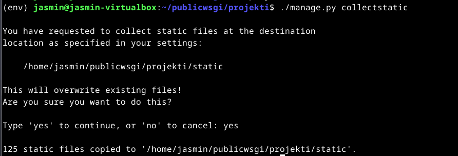

## x)
Python Web – Idea to Production
Kurssilla opit tekniikoita, jotka
- Palvelee asiakkaita kaikilla alustoilla
- Kerää tietoa palvelun käytöstä.
- Mahdollistaa usean käyttäjän muokata tiedostoa samanaikaisesti.
- Toimii ilman paikallista asennusta
(Karvinen, T. 2023)

Django 4 Instant Customer Database Tutorial
- Edellytyksenä asennettu linux, komentokehoitteen hallinta.
- Ohjeet kehitysympäristön asennukseen ja sen käyttöönottoon.
- Kehityspalvelinta ei laiteta internettiin.
(Karvinen,T. 2022)

Deploy Django 4 - Production Install
- Edellytyksenä komentokehoitteen hallinta, Linuxin käyttö ja virtuaali palvelin.

Projektia varten
- Apache2 web-palvelin. 
- Django projekti
- Djangon ja apachen yhdistämistä varten kolme tärkeää polkua
	- "/home/esimerkki/publicwsgi/esimerkkico/ (TDIR)
	- "/home/esimerkki/publicwsgi/esimerkkico/esimerkkico/wsgi.py" (TWSGI)
	- "/home/esimerkki/publicwsgi/env/lib/python3.11/site-packages" (TVENV)
(Karvinen,T.2022)
## a)
Lähdin asentamaan Djangoa [Teron artikkelin](https://terokarvinen.com/2022/django-instant-crm-tutorial/) avustuksella. Aloitin päivittämällä pakettilistat ja sen jälkeen asensin virtuaalisen kehitysympäristön.
```bash
sudo apt update
sudo apt-get install -y virtualenv
```


Seuraavaksi ajoin komennon `virtualenv --system-site-packages -p python3 env/`, joka luo virtuaaliympäristön. `source env/bin/activate` komento ottaa käyttöön virtuaaliympäristön. 


`micro requirements.txt` Loin requirements tiedoston, johon kirjoitin 'django'. 
`pip install -r requirements.txt` -komento käyttää pip-työkalua(paketinhallinta) asentamaan paketit, jotka on requirements.txt -tiedostossa, eli tässä tapauksessa djangon. Ajoin komennon `django-admin --version` joka tulostaa djangon version. 


`django-admin startproject projekti` -komento luo uuden projektin, tässä tapauksessa projekti -nimisen. Menin `cd projekti` -komennolla projekti kansioon, jossa ajoin komennon  `./manage.py runserver`, joka käynnistää testipalvelimen


## b)
127.0.0.1:8000/admin -osoitteessa oli kirjautumissivu valmiina, mutta ei käytössä.
```
./manage.py makemigrations
./manage.py migrate
```
Komennoilla päivitetään tietokanta.


`./manage.py createsuperuser` -komennolla päästään luomaan uutta käyttäjää.


Pääsin kirajutumaan admin -sivulle luomallani käyttäjällä.


Tein toisen käyttäjän. Nimeksi laitoin 'esimerkki' ja permissions -kohdasta laitoin staff ja superuser kohdat. 


Esimerkki käyttäjä toimii.


### CRM tietokanta

Loin uuden hakemiston crm sovellukselle `./manage.py startapp crm` -komennolla.


`micro settings.py` -komennolla avasin settings tiedoston, jonne lisäsin INSTALLED_APPS -osioon 'crm'.


`micro crm/models.py` -komennolla saadaan lisättyä "customer" taulu tietokantaan. 


```bash
./manage.py makemigrations
./manage.py migrate
```
Komennoilla päivitin jälleen tietokannan.


`micro crm/admin.py` -komennolla rekisteröin muutokset.


CRM lisätty onnistuneesti. Myös asiakkaiden lisäys onnistuu, vaikkakin nimet näkyvät tällä hetkellä vain 'Customer object' -muodossa.


Nimi ongelma saadaan korjattua muokkaamalla aiemmin luotua models.py -tiedostoa, missä Customer -luokka sijaitsee. 


Nyt asiakkaiden nimet näkyvät.


## c)
Lisätään uusi virtualhost `sudoedit /etc/apache2/sites-available/projekti.conf` -komennolla. 


Otin sivun käyttöön `sudo a2ensite projekti.conf` -komenolla ja otin oletus konfiguraatio tiedoston pois `sudo a2dissite 000-default.conf` -komenolla. Tämän jälkeen käynnistin apachen uudelleen. 
Testasin curlilla toimiiko sivu. 


## Connect Python to Apache using mod_wsgi
Kopioin aiemmin luomani projektin publicwsgi -kansioon.

Lähin muokkaamaan VirtualHost konfiguraatio tiedostoa `sudoedit /etc/apache2/sites-available/projekti.conf` -komennolla.


Kopioin tiedoston [Teron](https://terokarvinen.com/2022/deploy-django/) ohjeesta. 

Asensin Apache WSGI modulen `sudo apt-get -y install libapache2-mod-wsgi-py3` -komennolla. 


Testasin syntaksin `/sbin/apache2ctl configtest` -komennolla. 
Ajoin `curl localhost|grep title` -komennon ja terminaaliin tulostui `<title>500 Internal Server Error</title>`.


Hetken mietittyäni missä taas meni vikaan tajusin avata projekti.conf tiedoston ja lähdin tarkastamaan sitä mahdollisten typojen varalta. Huomasin "Define TVENV" -kohdassa python version olevan väärä (3.9), joten vaihdoin sen oikeaan (3.11). 
Käynnistin apachen uudelleen ja tämän jälkeen alkoi toimimaan. 


### Disable debug

Lähdin ottamaan virheilmoituksia pois päältä.  Tämä tapahtui suorittamalla seuraavat toimenpiteet: 
`micro settings.py` -komennolla muokataan settings -tiedostoa.


`touch wsgi.py` -komento päivittää tiedoston. 

### STATIC assets
Sivu on aika karun näköinen ilman tyylejä. 


Muokkasin setting.py tiedostoa ja lisäsin sinne seuraavat tiedot:
```py
import os
STATIC_ROOT = os.path.join(BASE_DIR, 'static/')
```

Ajoin komennon `./manage.py collectstatic` ja sivu näytti taas paremmalta.




## Django käyttämään PostgreSQL-tietokantaa
Asensin postgersql `sudo apt-get postgresql` -komennolla.


Ripgrepillä hain tietokannan nimeä, jotta selviäisi missä se on määritelty.  
Avasin settings.py tiedoston, josta avasin DATABASES -muuttujan yläpuolella olevan linkin. Sieltä kopioin esimerkki konfiguraation postgresille. Lisäsin sen setting.py -tiedostoon.


Testasin avata localhost/admin/ sivua, mutta se ei toiminut. Terminaaliin tulostui "Error loading psycopg2"
Asensin siis psycopg:n komennolla `sudo apt install python3-psycopg2`.


Yritin ajaa palvelua uusiksi, mutta terminaaliin tulostui, että salasana ei kelpaa.

Tein uuden käyttäjän netistä löytämäni [ohjeen](https://medium.com/coding-blocks/creating-user-database-and-adding-access-on-postgresql-8bfcd2f4a91e) mukaan. Tämänkin jälkeen tuli terminaaliin valitusta oikeus ongelmista.


Löysin stackoverflosta [ohjeen](https://stackoverflow.com/questions/12720967/how-can-i-change-a-postgresql-user-password), jonka mukaan vaihdoin postgres käyttäjän salasanan. Päivitin käyttäjän jälleen setting.py -tiedostossa.  


Ajoin migraatiot uudelleen, tein uuden superuserin ja käynnistin apachen uudelleen, ja kaikki alkoi jälleen toimimaan. 


## Lähteet
Karvinen, T. 2022. Deploy Django 4 – Production Install. Luettavissa: https://terokarvinen.com/2022/deploy-django/.

Karvinen, T. 2022. Django 4 Instant Customer Database Tutorial. Luettavissa: https://terokarvinen.com/2022/django-instant-crm-tutorial. 

Karvinen, T. 2023. Python Web Idea to Production. Luettavissa: https://terokarvinen.com/2023/python-web-idea-to-production/#osaamistavoitteet.

Medium. 2017. Creating user, database and adding access on PostgreSQL. Luettavissa: https://medium.com/coding-blocks/creating-user-database-and-adding-access-on-postgresql-8bfcd2f4a91e.

Stackoverflow. 2012. How can I change a PostgreSQL user password?. Luettavissa: https://stackoverflow.com/questions/12720967/how-can-i-change-a-postgresql-user-password.

