## x) Edelliset tehtävät
- [H1](https://github.com/J-Huttunen/linux-palvelimet/blob/main/h1.md)
- [H2](https://github.com/J-Huttunen/linux-palvelimet/blob/main/h2.md)
- [H3](https://github.com/J-Huttunen/linux-palvelimet/blob/main/h3.md)
- [H4](https://github.com/J-Huttunen/linux-palvelimet/blob/main/h4.md)
- [H5](https://github.com/J-Huttunen/linux-palvelimet/blob/main/h5.md)
- [H6](https://github.com/J-Huttunen/linux-palvelimet/blob/main/h6.md)

y)
- Teron [artikkelissa](https://terokarvinen.com/2018/hello-python3-bash-c-c-go-lua-ruby-java-programming-languages-on-ubuntu-18-04/) esitellään miten eri ohjelmointikielillä voidaan tulostaa `Hello World` ja  kuinka niitä ajetaan terminaalissa.
- Esimerkiksi pythonilla tämä tapahtuu seuraavast:
```bahs
cat helloworld.py
print("Hello World")
python3 helloworld.py
```

## a) Hei maailma 
Aloitin asentamalla pythonin ja javan `sudo apt install openjdk-17-jdk ipython3` -komennolla.  C-kieli oli virtuaalikoneella valmiiksi asennettuna.

### Python
Tein microlla `heimaailma.py` nimisen tiedoston, jonne kirjoitin `print("Hei Maailma")`. Ajoin tämän komennolla `python3 heimaailma.py`. 

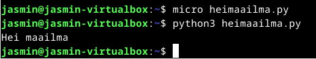

### C
Tein microlla `heimaailma.c` tiedoston, johon laitoin:
```C
#include <stdio.h>
int main()
{
 printf("Hei maailma\n");
}
```
Ajoin tiedoston komennoilla `gcc heimaailma.c -0 heimaailmac` ja `./heimaailmac`

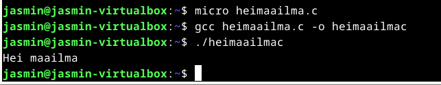

### Java
Tein tiedoston `Heimaailma.java`, johon laitoin:
```java
public class Heimaailma
{
 public static void main(String[] args)
 {
 System.out.println("Hei maailma");
 }
}
```
Ajoin tämän komennoilla `javac Heimaailma.java` ja `java Heimaailma`

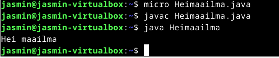

## b) Hei maailma muulla kielellä
Päätin kääntää "hei maailma" rust -kielellä. Asensin rustin `$ curl --proto '=https' --tlsv1.2 https://sh.rustup.rs -sSf | sh` -komennolla. 
Asennuksen jälkeen ajoin terminaalissa komennon `cargo new heimaailma`, tämä loi uuden projektin, jonka nimi on heimaailma. Ajoin komennon`micro src/main.rs`, jolla pääsin muokkaamaan rustin main oletustiedostoa. Ajoin cargo run, joka ajaa projektin.

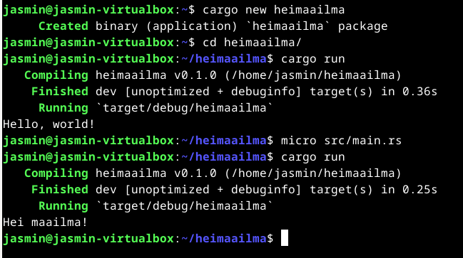

## c) Python taskulaskimena
Ajoin komennon `python3`, jotta pääsin käyttämään pythonia laskimena. 
Laitoin sinne 1+1 ja python palautti vastauksen.

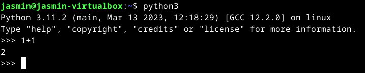

## d) Shell Script 
Tein shell scriptin, joka kysyy käyttäjän nimeä ja nimen syöttämisen jälkeen tulostaa `Tervetuloa $nimi`.
Loin scriptin `micro tervehdys.sh` -komennolla.
Lisäsin siihen execute oikeudet `chmod +x tervehdys.sh` -komennolla.

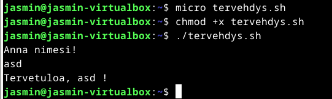

## e) Uusi komento
Siirsin tervehdys.sh -tiedoston usr/local/bin/ -kansioon, jotta voin käyttää sitä komentona kaikilla käyttäjillä. Tarkistin tiedoston oikeudet `ls -la` -komennolla. 
Komentoa voi nyt ajaa`tervehdys.sh` -komennolla. 

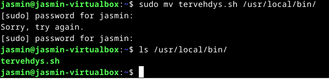

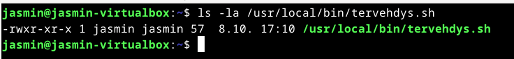

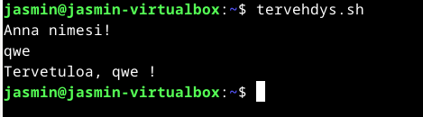

Kävin vielä tiedostosta poistamassa sh -päätteen, jolloin voidaan ajaa vain `tervehdys`
Tein käyttäjän "testi" ,jolla kävin testaamassa, että komento toimii.

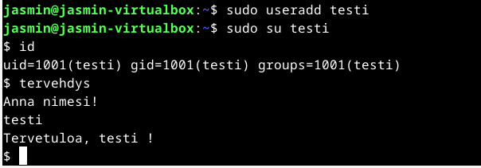

## f) Intelligent intelligence
Lähdin tekemään [tätä](https://terokarvinen.com/2017/arvioitava-laboratorioharjoitus-linux-palvelimet-ict4tn021-4-tiistai-alkusyksy-2017-5-op/) laboratorio harjoitusta. 
Tämä harjoitus eroaa jonkin verran siitä, mitä olemme tällä kursilla tehneet, mutta harjoituksen vuoksi päädyin tähän.

### Käyttäjät
Aloitin tekemällä uusia käyttäjiä `sudo adduser` -komennolla. 

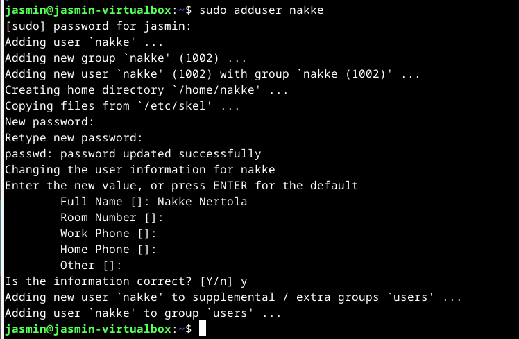

Asensin MariaDB:n ja php:n. 

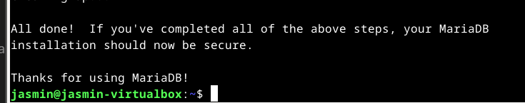

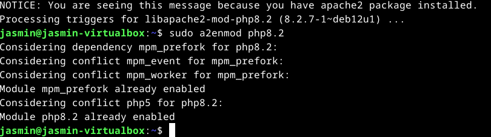

Testasin, että php toimii.

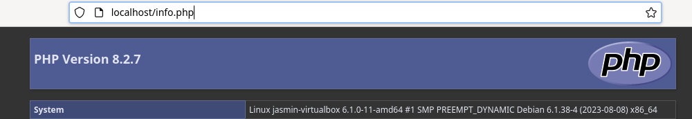

Ennen käyttäjien sivujen luomista kävin ottamassa apachen oletus konfiguraation käyttöön `sudo a2ensite 000-default.conf` -komennolla. 
Kirjauduin root -käyttäjälle  `sudo su` -komennolla ja tein kaikille  käyttäjille esimerkkisivut, luomalla kaikille käyttäjille kansin public_html ja tiedoston index.php.

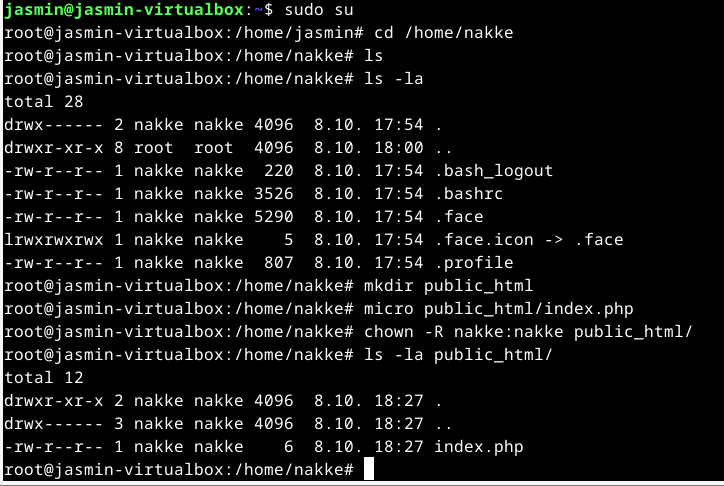

Lisäsin execute oikeudet kaikille, jotta saan sivut näkyviin. 

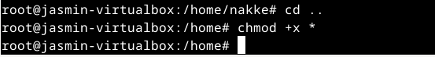

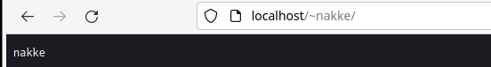

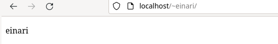

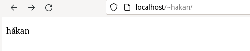

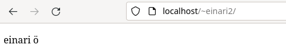

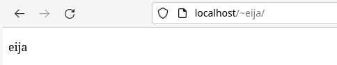


### WhoWhere
Tein shell scriptin joka palautti "hello ninja", koneen ip:n ja komentoa ajavan käyttäjän nimen.

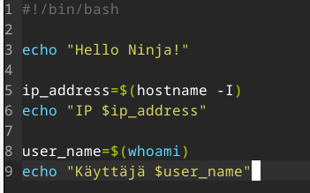

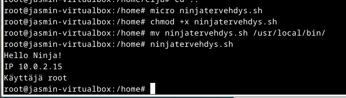

### SneakyGarden.Example.com
Lisäsin uuden eija -nimisen käyttäjän mysql:ään ja lisäsin uuden tietokannan nimeltä ninjaliikkeet. Lisäsin myös eija -käyttäjälle kaikki oikeudet. 

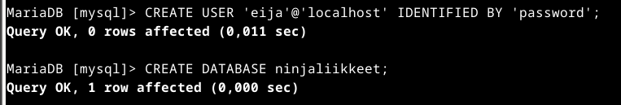

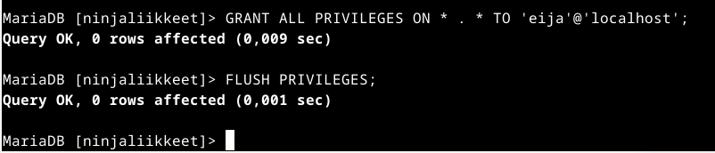

Lisäsin ninjaliikkeet kantaan taulun "liikkeet", johon tuli id, liikkeen nimi ja vaikeustaso.  

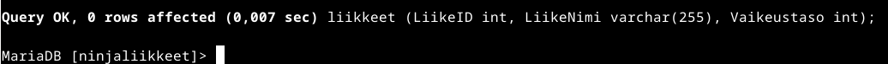

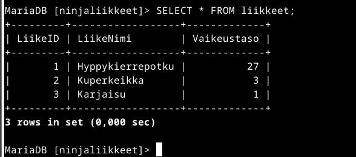

`mods-enabled kansion php*.conf` -tiedostoon kävin  muokkaamassa php admin flag=On. Tämän tein, jotta sain eijan sivulle näkymään tietokannan tiedot. 

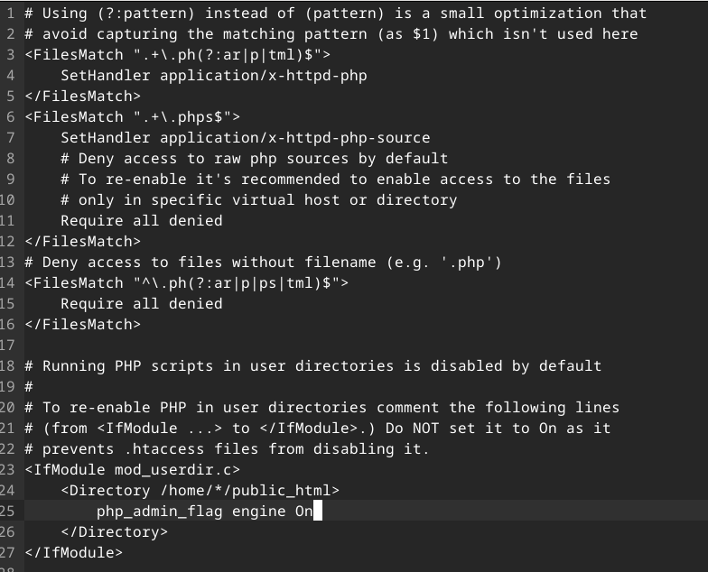

Ajan loppumisen takia tämän osuuden suorittaminen jäi tyngäksi. 
Sivu on kuitenkin nyt eijan muokattavissa localhostissa.

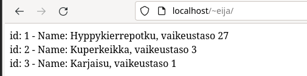

### Uusi ylläpitäjä
Tein uuden käyttäjän `adduser jussi` -komennolla. Lisäsin sille sudo oikeudet `adduser jussi sudo`. 

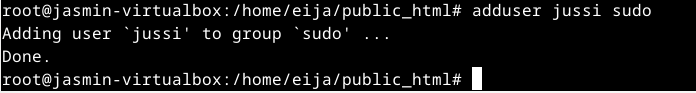

## g) Uusi virtuaalikone
Tein uuden Debian koneen samalla tavalla kuin H1-raportissa. Asennuksen jälkeen kävin varmistamassa, että nettiyhteys ja näppäimistö toimii. 

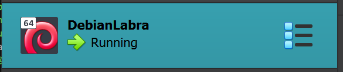

## Lähteet

CrownCloud. sa. How to Install LAMP Stack on Debian 11 bullseye. Luettavissa: https://wiki.crowncloud.net/?How_to_install_LAMP_stack_on_debian_11_bullseye

MySQL. sa. ### Connecting to the MySQL Server Using Command Options. Luettavissa: https://dev.mysql.com/doc/refman/8.0/en/connecting.html

Hosthinger. 2023. How to Create MySQL User and Grant Privileges in 2023. Luettavissa: https://www.hostinger.com/tutorials/mysql/how-create-mysql-user-and-grant-permissions-command-line

W3schools. sa. PHP Connect to MySQL. Luettavissa: https://www.w3schools.com/php/php_mysql_connect.asp

Karvinen, T. 2018. Hello World Python3, Bash, C, C++, Go, Lua, Ruby, Java – Programming Languages on Ubuntu 18.04. Luettavissa: https://terokarvinen.com/2018/hello-python3-bash-c-c-go-lua-ruby-java-programming-languages-on-ubuntu-18-04/
